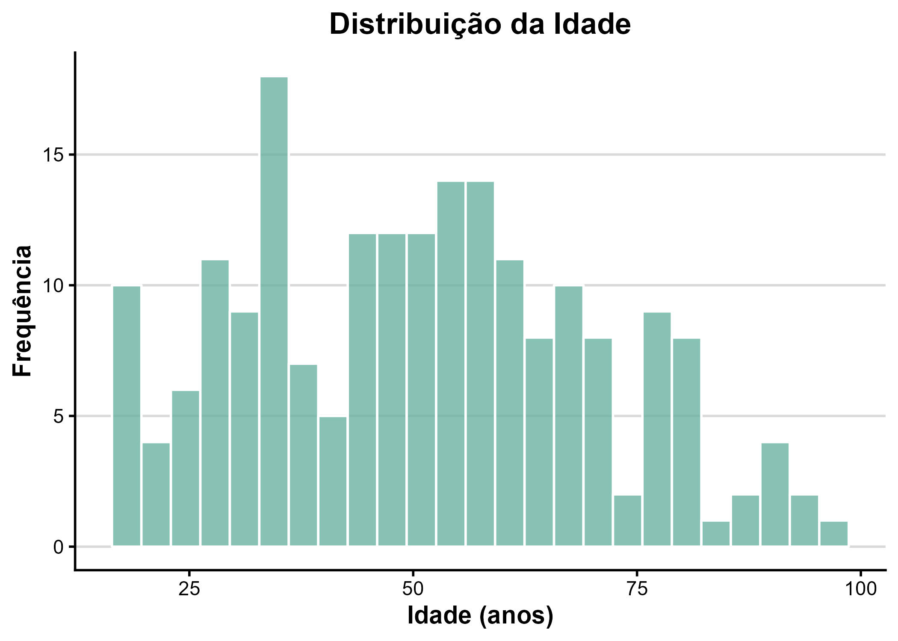
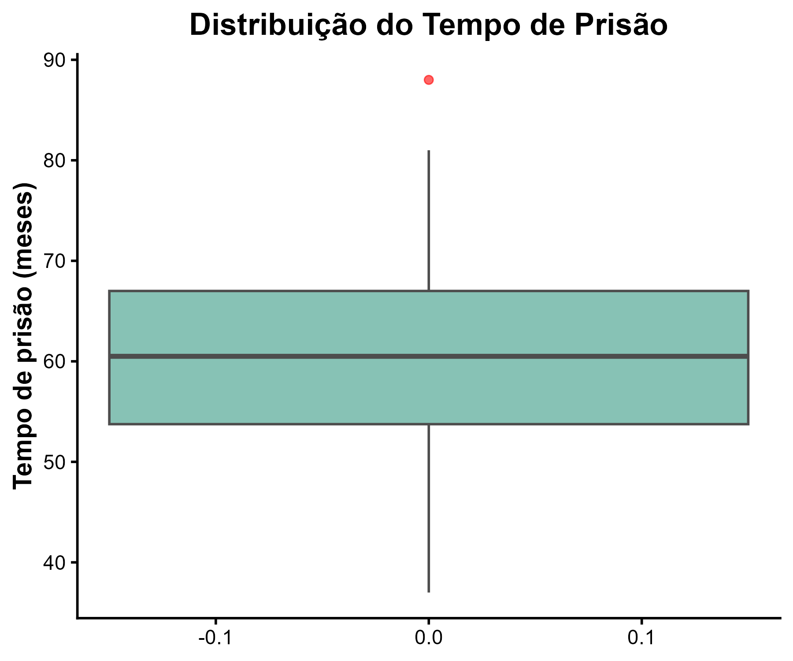
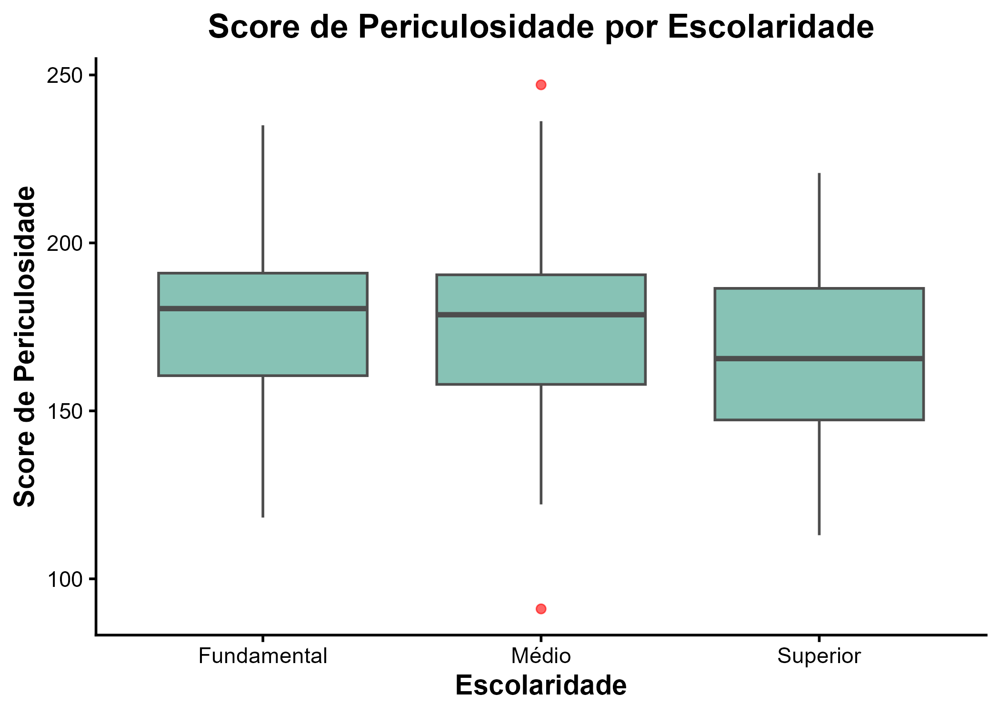
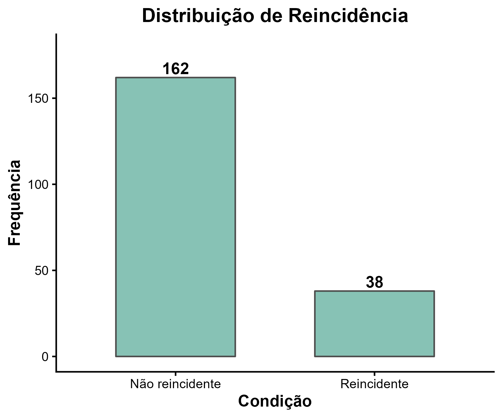

# AnaliseExploratoria
Projeto da disciplina Prática Estatística I, com análise exploratória de dados em R usando gráficos, medidas de resumo e correlação.

*Commit* é uma forma de salvar o progresso do projeto de maneira segura, registrando uma cópia do estado atual dos arquivos. Isso permite acompanhar as alterações feitas e voltar a versões anteriores sempre que necessário.

# Análise exploratória visual obtida no Script_analise_visual

## Distribuição da Idade

  

O histograma da variável idade apresenta uma distribuição relativamente heterogênea, com idades variando entre aproximadamente 20 e 100 anos. Observa-se uma concentração maior de detentos na faixa entre 40 e 60 anos, enquanto há menor frequência nas extremidades (idosos e jovens).  
A distribuição não é perfeitamente simétrica, sugerindo leve assimetria à direita, indicando que existem alguns indivíduos mais velhos que puxam a cauda superior da distribuição.

---

## Distribuição do Tempo de Prisão

  

O boxplot de tempo_preso mostra que o tempo de encarceramento varia entre cerca de 40 e 90 meses, com mediana próxima a 60 meses (5 anos).  
Há a presença de outliers acima de 80 meses, representando casos isolados de detentos com tempo de prisão superior ao padrão do grupo.  
A dispersão é moderada, indicando variação significativa entre os tempos de cumprimento de pena.

---

## Score de Periculosidade por Escolaridade

  

O boxplot comparando score_periculosidade por escolaridade mostra distribuições relativamente semelhantes entre os três níveis (Fundamental, Médio e Superior).  
As medianas se situam em torno de 180 a 190 pontos, com leve tendência de redução do score conforme o nível de escolaridade aumenta, especialmente no grupo com ensino superior.  
Também há outliers pontuais (valores extremos), principalmente entre os indivíduos com escolaridade média.

---

## Distribuição de Reincidência

  

O gráfico de barras evidencia que a maioria dos detentos não é reincidente: cerca de 162 dos indivíduos estão nessa categoria, enquanto apenas 38 são reincidentes.  
A diferença é visualmente marcante, reforçando que a reincidência é minoria neste conjunto de dados.

---

## Conclusão 
As variáveis apresentaram distribuições coerentes e sem dados faltantes. O perfil dos detentos é formado, em sua maioria, por adultos entre 40 e 60 anos, não reincidentes e com tempo médio de prisão de cerca de cinco anos. Observa-se ainda que níveis mais altos de escolaridade tendem a estar associados a scores de periculosidade ligeiramente menores.

---

## Definições das medidas de tendência central e dispersão

Considerando um conjunto de observações \( x_1, x_2, \ldots, x_n \):

- **Média:**  
  \[
  \bar{x} = \frac{1}{n} \sum_{i=1}^{n} x_i
  \]  
  A média é o somatório de todas as observações dividido pela quantidade de observações.  
  Ela representa o valor médio dos dados, ou seja, o ponto de equilíbrio do conjunto.

- **Mediana:**  
  A mediana é o valor central do conjunto de dados quando as observações estão em ordem crescente.  
  Se o número de observações for ímpar, a mediana é o valor central; se for par, é a média entre os dois valores centrais.  
  Ou seja, é o ponto que divide o conjunto em duas metades iguais.

- **Variância:**  
  \[
  \sigma^2 = \frac{1}{n} \sum_{i=1}^{n} (x_i - \bar{x})^2
  \]  
  A variância é a soma dos quadrados das diferenças entre cada observação e a média, dividida pela quantidade total de observações.  
  Ela mede o quanto os valores se afastam da média, expressando a dispersão dos dados.

- **Desvio padrão:**  
  \[
  \sigma = \sqrt{\sigma^2}
  \]  
  O desvio padrão é a raiz quadrada da variância.  
  Ele indica, em média, o quanto as observações se afastam da média e possui a mesma unidade dos dados originais.

- **Amplitude:**  
  \[
  A = \max(x_i) - \min(x_i)
  \]  
  A amplitude é a diferença entre o maior e o menor valor observado.  
  Ela mostra a variação total do conjunto de dados, indicando o intervalo entre os extremos.
